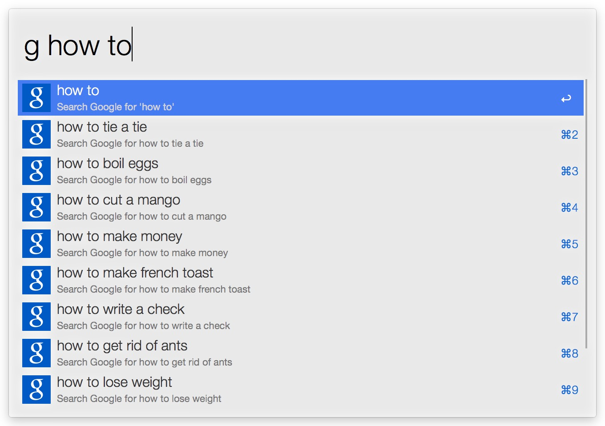
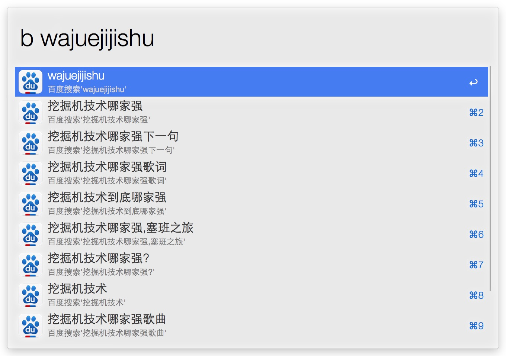

# Alfred Workflows
Workflows for Alfred 2.

## Google Suggest
修改自Alfred的example，添加使用`tab`自动补全，可在网络请求未完成时可直接搜索。
> Triggers: `g`

## Baidu Suggest
照虎画猫，和Google Suggest一样。
> Triggers: `b`

## Requirements
1. [Alfred App v2](http://www.alfredapp.com/#download)
1. [Alfred Powerpack](https://buy.alfredapp.com/)